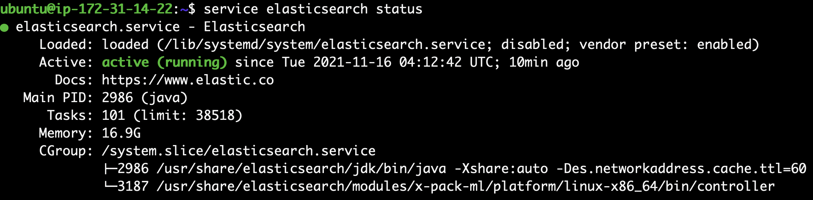

# Elasticsearch Installation on Ubuntu20.04

This is a guide for Elasticsearch installation on Ubuntu 20.04

## Step 1 - Prepare the Environment

Install java11 - You can follow this guideline to install java ([https://github.com/ozgunakin/java-installation-on-ubuntu20.04](https://github.com/ozgunakin/java-installation-on-ubuntu20.04))

Install apt-transport-https

```
sudo apt install apt-transport-https 
```

Update GPG key

```
wget -qO - https://artifacts.elastic.co/GPG-KEY-elasticsearch | sudo apt-key add - 
```

Add the repository to your system

```
add-apt-repository "deb https://artifacts.elastic.co/packages/7.x/apt stable main" 
```

## Step 2 - Install Elasticsearch with Apt

Install latest version ap elasticsearch using apt package manager.

```
sudo apt update 
sudo apt install elasticsearch
```

## Step 3 - Configure Elasticsearch

You can skip this step if you dont want to access elasticsearch from remote server.

Edit Elasticsearch yml file which is placed in /etc/elasticsearch.

```
sudo nano /etc/elasticsearch/elasticsearch.yml
```

Change the following lines and save the file.

> network.host =0.0.0.0      #sholud be chaged to be able to elastic from remote server
>
> discovery.seed.hosts = \["your-ip-address"]

## Step 4 - Start & Enable Elasticsearch

Start elasticsearch as a service

```
sudo systemctl start elasticsearch
```

Enable Elasticsearch service

```
sudo systemctl enable elasticsearch
```

Check the status

```
service elasticsearch status
```

The output should be like the following;



## Step - 5 Test Elasticsearch

Your Elasticsearch service is up and running now. You can communicate with elasticsearch using curl command, for example you can use the command below to get information about your cluster.

```
curl -X GET "http://localhost:9200/?pretty" 
```

The output should be like;

.png>)

## Hint

If there is a problem with your installation you can purge elasticsearch with using the following commands and try again.

```
sudo apt-get remove elasticsearch

sudo apt-get --purge autoremove elasticsearch

sudo rm -rf /var/lib/elasticsearch/ 
sudo rm -rf /etc/elasticsearch
```
